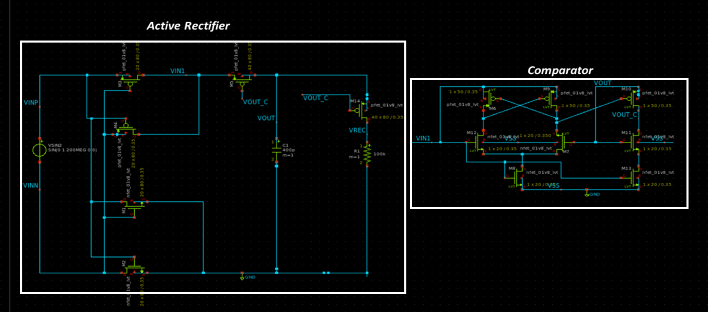
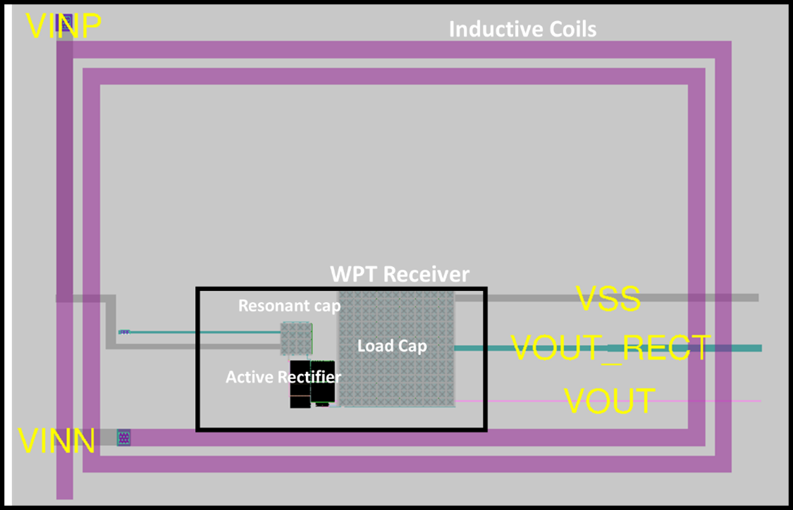
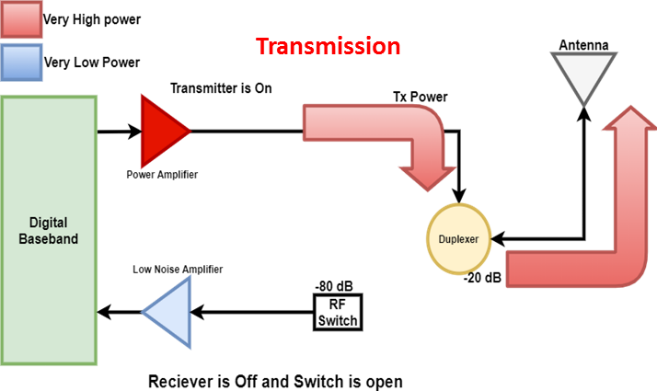
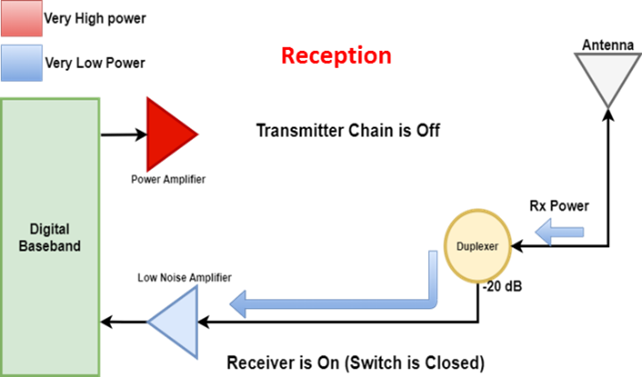
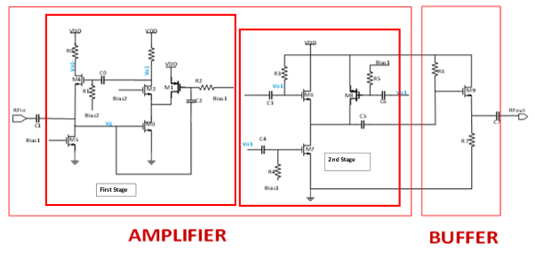
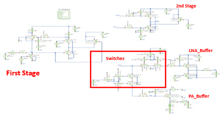
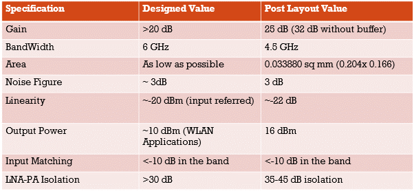
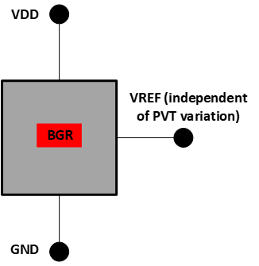

  

---

RFCS2/ICD MPW-4 Projects
========================

Backscattering Integration for On-Chip Wireless Power Transfer (WPT) Receivers
------------------------------------------------------------------------------

### **Introduction**

Proposed project implement WPT system having the capability of a passive
backscattering using the single power transfer coils. The design goal of
project will be to implement an on-chip resonant WPT system that capable
of harvesting energy from external off chip coils, harvest the megnteic
energy using an active recitifier and derive a load.

{width="3.5194444444444444in"
height="1.5597222222222222in"}

Wireless Power Transmission (WPT) is realized using resonant coils.
Primary and Secondary coils are loaded with capacitors which are tuned
at same frequency. Despite of low coupling coefficients MCR-WPT provides
high power transfer at a single resonant frequency . Active
rectification was used technique for improving the efficiency
of [rectification](https://en.wikipedia.org/wiki/Rectifier) by
replacing [diodes](https://en.wikipedia.org/wiki/Diode) with actively
controlled switches with or power [bipolar junction
transistors](https://en.wikipedia.org/wiki/Bipolar_junction_transistor). 
Normal semiconductor diodes have a roughly fixed voltage drop of around
0.5-1 volts, active rectifiers behave as resistances, and can have
arbitrarily low voltage drop. The voltage drop across the transistor is
then much lower, which reduces the power loss. Finally an off chip
'backscattered signal' is used to change the impedence of coils.

### **Circuit Schematic**

{width="5.284722222222222in"
height="2.3333333333333335in"}

### **Layout**

{width="5.115277777777778in"
height="3.291488407699038in"}

Bi-Directional Amplifier Architecture for Sub-6 GHz 5G
------------------------------------------------------

### **Introduction**

TDD (Time division duplexing) RF front ends operate in such a manner
that during Transmission, receiver side is isolated using and switch and
power amplifier is driving the transmission antenna, During Reception,
transmitter chain is isolated and the received signal from the antenna
is fed to a low noise amplifier.

{width="2.986111111111111in"
height="1.7772911198600174in"}
{width="2.9166666666666665in"
height="1.7161417322834647in"}

Figure below shows the 2-stage amplifier that is used to provide voltage
gain in the circuit. In the first stage Transistors M0 and M1 provide
transconductance. Transistor M1 also reduces current through M2 and
increases the value of Resistor and drain of M2. Due to this cascode and
current re-use technique we obtain a large voltage gain. Transistor M4
is used to provide voltage to current feedback from output to input such
that the input impedance is governed transistor M4. Transistor M5
establishes bias voltage for the gate of M0. The second stage combines
the differential output from stage 1 in such a way that the noise
contribution of transistor M4 is cancelled.

{width="6.268055555555556in"
height="3.0560597112860894in"}

### **Circuit Schematic**

{width="4.673611111111111in"
height="2.4419083552055993in"}

### **Circuit Layout**

{width="6.268055555555556in"
height="3.242451881014873in"}

{width="6.268055555555556in"
height="3.2555555555555555in"}

{width="6.268055555555556in"
height="3.5243055555555554in"}

{width="6.268055555555556in"
height="3.2194444444444446in"}

{width="6.268055555555556in"
height="3.0419378827646546in"}

{width="6.268055555555556in"
height="2.898507217847769in"}

Operational Amplifier
=====================

Operational Amplifier is a fundamental analog circuit that is used in
numerous applications. A conventional two stage opamp is implemented to
be tested on chip and be further used in ADC circuits.

{width="6.268055555555556in"
height="2.8722222222222222in"}

{width="6.268055555555556in"
height="3.051388888888889in"}

{width="6.268055555555556in"
height="3.665277777777778in"}

{width="6.268055555555556in"
height="3.588888888888889in"}

{width="6.268055555555556in"
height="3.6118055555555557in"}

{width="6.268055555555556in"
height="3.61875in"}

  Differential Gain   60 dB
  ------------------- ---------------
  Common Mode Gain    5 dB
  CMRR                55 dB
  Voltage             $\pm \ 0.9$ V
  GBW                 190MHz
  Phase Margin        55 Degrees

4)  Band Gap Reference
    ------------------

5)  Bandgap Reference (BGR) is general purpose IP block that generates a
    constant dc voltage independent of all variations including supply,
    temperature and process. **Analog circuits such as** opamps, DC-DC
    converters, voltage control oscillators (VCO) and current mirrors
    used **voltage references extensively.** The figure of merit for
    these systems mainly depends on the accuracy and preciseness of
    voltage reference.

6)  {width="3.3916666666666666in"
    height="3.4916666666666667in"}

7)  Schematic:

8)  {width="3.058333333333333in"
    height="3.441666666666667in"}

9)  Explanation:

10) The proposed first order BGR is auto start which eliminates the
    start-up circuit. The cascode structure is designed to give a large
    swing, which is not limited by the supply voltage headroom. This
    design does not need a bias circuit. The V~DS~ voltage of MN1 and
    MN2 is utilized to create the bias voltage for MP5 and MP4 instead
    of employing a PMOS transistor. So, a complementary cross-coupled
    structure is designed instead of simple cascode to create the
    V\_Bias (at node B) voltage by itself, as illustrated in Fig. 1-1.
    Furthermore, this architecture improves the gain of cascode stage
    and accurately mirrors the PTAT, improving the temperature
    coefficient and minimising the mismatches between node X and Y.

11) {width="6.268055555555556in"
    height="3.401388888888889in"}

12) {width="6.266666666666667in"
    height="3.2333333333333334in"}

13) {width="6.268055555555556in"
    height="2.6840277777777777in"}

14) 

  V ref                     1.21 V
  ------------------------- ----------------------
  Temperature Range         -40 ^o^C to 140 ^o^C
  Supply voltage            2.5 to 4 V
  Temperature Coefficient   10 **ppm/°C**
  Lin regulation            8 mV
  Start-up time             40 µS
